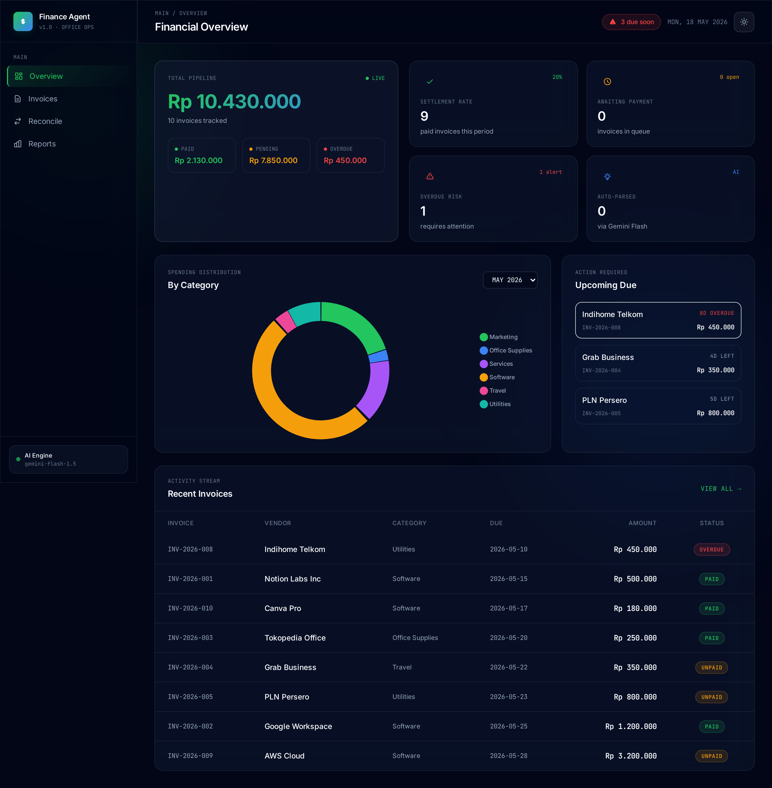

# Finance Agent 💼

> AI-powered finance automation tool for office workers. Scan invoices with Gemini 2.5 Flash, auto-reconcile bank statements, and generate monthly reports — all in one premium glassmorphism dashboard.

[](#)
[](#)
[](#)
[](#)
[](LICENSE)



---

## ✨ Features

### 🤖 AI Invoice Scanner
Drop a photo of any invoice and Gemini 2.5 Flash extracts vendor, amount, dates, category, and description in ~5 seconds. No manual data entry.

### 📊 Smart Dashboard
- Real-time financial pipeline metrics (paid / pending / overdue)
- Spending distribution by category with interactive donut chart
- Upcoming due reminders with urgency color coding
- Recent invoice activity stream

### 🔄 Bank Reconciliation
Upload your bank statement CSV, click reconcile — invoices get auto-matched against transactions with ±1% amount tolerance. Mismatches highlighted instantly.

### 📈 Monthly Reports
- Period selector (last 12 months)
- Category breakdown with progress bars
- Detailed invoice list
- One-click Excel export with formatted styling

### 🎨 Premium UI
- **Glassmorphism design** — frosted cards, ambient glow
- **Light + Dark mode** with auto-persist
- **Inter + JetBrains Mono** typography
- Responsive: 375px → 1440px

---

## 🚀 Live Demo

> **Demo URL:** _coming soon_

Try the AI scan with any invoice photo — works with both digital invoices and photographed paper receipts.

---

## 🛠 Tech Stack

| Layer | Technology |
|---|---|
| **Backend** | Flask 3.1 + SQLite |
| **AI Vision** | Google Gemini 2.5 Flash via OpenRouter |
| **Frontend** | Tailwind CSS + Vanilla JS + Chart.js |
| **Export** | openpyxl (Excel) |
| **Deploy** | Vercel / Railway / PythonAnywhere ready |

---

## 📦 Quick Start

```bash
# 1. Clone
git clone https://github.com/moonzyr17/finance-agent.git
cd finance-agent

# 2. Setup venv
python3 -m venv .venv
source .venv/bin/activate
pip install -r requirements.txt

# 3. Configure API key
cp .env.example .env
# Edit .env and add your OpenRouter API key

# 4. Run
gunicorn app:app -b 127.0.0.1:5099
# or for development:
python app.py
```

Open http://127.0.0.1:5099

---

## 🔑 Environment Variables

| Variable | Required | Description |
|---|---|---|
| `OPENROUTER_API_KEY` | ✅ | Get from [openrouter.ai/keys](https://openrouter.ai/keys) |

---

## 📂 Project Structure

```
finance-agent/
├── app.py                    # Flask app + API routes
├── api/index.py              # Vercel entrypoint
├── data/
│   ├── finance.db           # SQLite (auto-generated)
│   └── seed.json            # Sample data
├── templates/
│   ├── base.html            # Layout + theme system
│   ├── dashboard.html       # Overview page
│   ├── invoices.html        # Invoice management
│   ├── reconcile.html       # Bank reconciliation
│   └── reports.html         # Monthly reports
├── static/
│   └── sample-transactions.csv
├── Procfile                  # Railway/Heroku
├── vercel.json              # Vercel config
└── requirements.txt
```

---

## 📡 API Endpoints

| Method | Path | Description |
|---|---|---|
| `POST` | `/api/scan` | Upload invoice image → AI parsed JSON |
| `GET` | `/api/invoices` | List all invoices (filterable by status) |
| `POST` | `/api/invoices` | Create invoice manually |
| `PATCH` | `/api/invoices/:id` | Update invoice (status, amount, etc.) |
| `DELETE` | `/api/invoices/:id` | Delete invoice |
| `GET` | `/api/stats` | Aggregate financial metrics |
| `GET` | `/api/reminders` | Invoices due in next 7 days |
| `POST` | `/api/transactions/upload` | Upload bank CSV |
| `POST` | `/api/reconcile` | Auto-match invoices to transactions |
| `GET` | `/api/report/monthly?month=YYYY-MM` | Monthly aggregation |
| `GET` | `/api/export/excel?month=YYYY-MM` | Download .xlsx report |

---

## 🌍 Deploy

### Vercel
```bash
vercel deploy --prod
```
Set `OPENROUTER_API_KEY` in project settings.

### Railway
```bash
railway up
railway variables set OPENROUTER_API_KEY=sk-or-v1-...
```

### PythonAnywhere
1. Upload repo to `~/finance-agent`
2. Set up venv via Bash console
3. Configure WSGI file to point to `app:app`
4. Add `OPENROUTER_API_KEY` to environment

---

## 🎯 Use Cases

- **Office Admin Staff** — eliminate manual invoice data entry
- **Small Business Owners** — track expenses + reconcile bank statements
- **Freelancers** — generate monthly client reports
- **Finance Teams** — automate vendor invoice processing

---

## 🗺 Roadmap

- [ ] Multi-currency conversion
- [ ] Recurring invoice templates
- [ ] Email reminder automation
- [ ] PDF report export
- [ ] OCR fallback for low-quality images
- [ ] Multi-user with role-based access

---

## 📝 License

MIT © [moonzyr17](https://github.com/moonzyr17)

---

<sub>Built with ☕ as part of an open-source portfolio. Star if useful!</sub>
